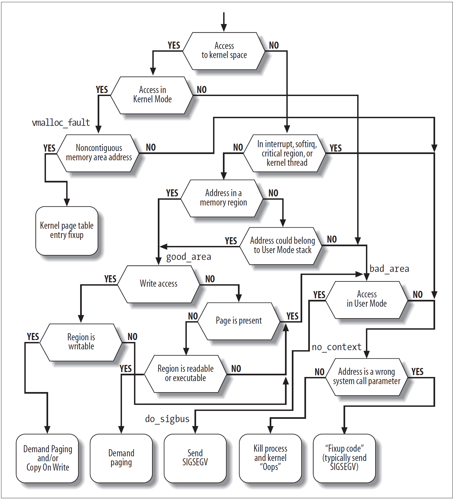

# Lab 6: RV64 缺页异常处理以及 fork 机制

> 非常建议大家先通读整篇实验指导，完成思考题后再动手写代码

## 1. 实验目的
* 通过 **vm_area_struct** 数据结构实现对 task **多区域**虚拟内存的管理。
* 在 **Lab5** 实现用户态程序的基础上，添加缺页异常处理 **Page Fault Handler**。
* 为 task 加入 **fork** 机制，能够支持通过 **fork** 创建新的用户态 task 。

## 2. 实验环境 
* Environment in previous labs.

## 3. 背景知识

下面介绍的是 Linux 中对于 VMA (virtual memory area) 和 Page Fault Handler 的介绍（顺便帮大家复习下期末考）。由于 Linux 巨大的体量，无论是 VMA 还是 Page Fault 的逻辑都较为复杂，这里只要求大家实现简化版本的，所以不要在阅读背景介绍的时候有太大的压力。

### 3.1 vm_area_struct 介绍
在 linux 系统中，`vm_area_struct` 是虚拟内存管理的基本单元，`vm_area_struct` 保存了有关连续虚拟内存区域（简称 vma）的信息。linux 具体某一 task 的虚拟内存区域映射关系可以通过 [procfs](https://man7.org/linux/man-pages/man5/procfs.5.html) 读取 `/proc/pid/maps` 的内容来获取:

比如，如下一个常规的 `bash`  task ，假设它的 task 号为 `7884` ，则通过输入如下命令，就可以查看该 task 具体的虚拟地址内存映射情况(部分信息已省略)。

```shell
#cat /proc/7884/maps
556f22759000-556f22786000 r--p 00000000 08:05 16515165                   /usr/bin/bash
556f22786000-556f22837000 r-xp 0002d000 08:05 16515165                   /usr/bin/bash
556f22837000-556f2286e000 r--p 000de000 08:05 16515165                   /usr/bin/bash
556f2286e000-556f22872000 r--p 00114000 08:05 16515165                   /usr/bin/bash
556f22872000-556f2287b000 rw-p 00118000 08:05 16515165                   /usr/bin/bash
556f22fa5000-556f2312c000 rw-p 00000000 00:00 0                          [heap]
7fb9edb0f000-7fb9edb12000 r--p 00000000 08:05 16517264                   /usr/lib/x86_64-linux-gnu/libnss_files-2.31.so
7fb9edb12000-7fb9edb19000 r-xp 00003000 08:05 16517264                   /usr/lib/x86_64-linux-gnu/libnss_files-2.31.so                 
...
7ffee5cdc000-7ffee5cfd000 rw-p 00000000 00:00 0                          [stack]
7ffee5dce000-7ffee5dd1000 r--p 00000000 00:00 0                          [vvar]
7ffee5dd1000-7ffee5dd2000 r-xp 00000000 00:00 0                          [vdso]
ffffffffff600000-ffffffffff601000 --xp 00000000 00:00 0                  [vsyscall]
```

从中我们可以读取如下一些有关该 task 内虚拟内存映射的关键信息：

* `vm_start`  :  (第1列) 指的是该段虚拟内存区域的开始地址
* `vm_end`    :  (第2列) 指的是该段虚拟内存区域的结束地址
* `vm_flags`  :  (第3列) 该 `vm_area` 的一组权限(rwx)标志，`vm_flags` 的具体取值定义可参考linux源代码的 [linux/mm.h](https://elixir.bootlin.com/linux/v5.14/source/include/linux/mm.h#L265)
* `vm_pgoff`  :  (第4列) 虚拟内存映射区域在文件内的偏移量
* `vm_file`   :  (第5/6/7列) 分别表示：映射文件所属设备号/以及指向关联文件结构的指针/以及文件名

注意这里记录的 `vm_start` 和 `vm_end` 都是用户态的虚拟地址，并且内核并不会将除了用户程序会用到的内存区域以外的部分添加成为 VMA。

可以看到，一段内存可以被用户程序当成某一个文件的一部分。如果这样的 VMA 产生了缺页异常，说明文件中对应的页不在操作系统的 buffer pool 中（回想起数据库课上学习的磁盘缓存了吗），或者是由于 buffer pool 的调度策略被换出到磁盘上了。这时候操作系统会用驱动读取硬盘上的内容，放入 buffer pool，然后修改当前 task 的页表来让其能够用原来的地址访问文件内容。而这一切对用户程序来说是完全透明的，除了访问延迟。

除了跟文件建立联系以外，VMA 还可能是一块匿名 (anonymous) 的区域。例如被标成 `[stack]` 的这一块区域，和文件之间并没有什么关系。

其它保存在 `vm_area_struct` 中的信息还有：

* `vm_ops`: 该 `vm_area` 中的一组工作函数，其中是一系列函数指针，可以根据需要进行定制
* `vm_next/vm_prev`: 同一 task 的所有虚拟内存区域由 **链表结构** 链接起来，这是分别指向前后两个 `vm_area_struct` 结构体的指针

可以发现，原本的 Linux 使用链表对一个 task 内的 VMA 进行管理。但是由于如今一个程序可能体量非常巨大，所以现在的 Linux 已经用虚拟地址为索引来建立红黑树了（如果你喜欢可以在这次实验中也手搓一棵红黑树）。

### 3.2 缺页异常 Page Fault
缺页异常是一种正在运行的程序访问当前未由内存管理单元（MMU）映射到虚拟内存的页面时，由计算机**硬件**引发的异常类型。访问未被映射的页或访问权限不足，都会导致该类异常的发生。处理缺页异常通常是操作系统内核的一部分，当处理缺页异常时，操作系统将尝试使所需页面在物理内存中的位置变得可访问（建立新的映射关系到虚拟内存）。而如果在非法访问内存的情况下，即发现触发 `Page Fault` 的虚拟内存地址（Bad Address）不在当前 task  `vm_area_struct` 链表中所定义的允许访问的虚拟内存地址范围内，或访问位置的权限条件不满足时，缺页异常处理将终止该程序的继续运行。 

#### 3.2.1 Page Fault Handler
总的说来，处理缺页异常需要进行以下步骤：

1. 捕获异常
2. 寻找当前 task 中对应了**导致产生了异常的地址**对应的 VMA
3. 判断产生异常的原因
4. 如果是匿名区域，那么开辟**一页**内存，然后把这一页映射到导致异常产生 task 的页表中。如果不是，那么首先将硬盘中的内容读入 buffer pool，将 buffer pool 中这段内存映射给 task。
5. 返回到产生了该异常的那条指令，并继续执行程序

当 Linux 发生缺页异常并找到了当前 task 中对应的 `vm_area_struct` 后，可以根据以下信息来判断发生异常的原因

1. CSRs
2. `vm_area_struct` 中记录的信息
3. 发生异常的虚拟地址对应的 PTE (page table entry) 中记录的信息

并对当前的异常进行处理。

Page Fault 是一类比较复杂的异常，可以看到 Linux 内核中的处理时的逻辑是充满了 `if` `else` 乃至 `goto` 的：


<!-- #### 3.2.1 RISC-V Page Faults
RISC-V 异常处理：当系统运行发生异常时，可即时地通过解析 `scause` 寄存器的值，识别如下三种不同的 Page Fault。

**SCAUSE** 寄存器指示发生异常的种类：

| Interrupt | Exception Code | Description |
| --- | --- | --- |
| 0 | 12 | Instruction Page Fault |
| 0 | 13 | Load Page Fault |
| 0 | 15 | Store/AMO Page Fault |

#### 3.2.2 常规处理 **Page Fault** 的方式介绍
处理缺页异常时所需的信息如下：

* 触发 **Page Fault** 时访问的虚拟内存地址 VA。当触发 page fault 时，`stval` 寄存器被被硬件自动设置为该出错的 VA 地址
* 导致 **Page Fault** 的类型：
    * Exception Code = 12: page fault caused by an instruction fetch 
    * Exception Code = 13: page fault caused by a read  
    * Exception Code = 15: page fault caused by a write 
* 发生 **Page Fault** 时的指令执行位置，保存在 `sepc` 中
* 当前 task 合法的 **VMA** 映射关系，保存在 `vm_area_struct` 链表中

处理缺页异常的方式：

- 当缺页异常发生时，检查 VMA
- 如果当前访问的虚拟地址在 VMA 中没有记录，即是不合法的地址，则运行出错（本实验不涉及）
- 如果当前访问的虚拟地址在 VMA 中存在记录，则进行相应的映射即可：
  - 如果访问的页是存在数据的，如访问的是代码，则需要从文件系统中读取内容，随后进行映射
  - 否则是匿名映射，即找一个可用的帧映射上去即可 -->


### 3.3 `fork` 系统调用

`fork` 是 Linux 中的重要系统调用，它的作用是将进行了该系统调用的 task 完整地复制一份，并加入 Ready Queue。这样在下一次调度发生时，调度器就能够发现多了一个 task，从这时候开始，新的 task 就可能被正式从 Ready 调度到 Running，而开始执行了。

* 子 task 和父 task 在不同的内存空间上运行。
* `fork` 成功时，父 task  `返回值为子 task 的 pid`，子 task  `返回值为 0`；`fork` 失败，则父 task  `返回值为 -1`。
* 创建的子 task 需要**深拷贝** `task_struct`，并且调整自己的页表、栈 和 CSR 等信息，同时还需要复制一份在用户态会用到的内存（用户态的栈、程序的代码和数据等），并且将自己伪装成是一个因为调度而加入了 Ready Queue 的普通程序来等待调度。在调度发生时，这个新 task 就像是原本就在等待调度一样，被调度器选择并调度。
<!-- * 创建的子 task 需要拷贝父 task  `task_struct`、`pgd`、`mm_struct` 以及父 task 的 `user stack` 等信息。 -->
* Linux 中使用了 `copy-on-write` 机制，`fork` 创建的子 task 首先与父 task 共享物理内存空间，直到父子 task 有修改内存的操作发生时再为子 task 分配物理内存（因为逻辑较为复杂，不要求所有同学都实现，如果你觉得这个机制很有趣，可以在实验中完成 COW 机制）。

Linux 的另一个重要系统调用是 `exec`，它的作用是将进行了该系统调用的 task 换成另一个 task 。这两个系统调用一起，支撑起了 Linux 处理多任务的基础。当我们在 shell 里键入一个程序的目录时，shell（比如 zsh 或 bash）会先进行一次 fork，这时候相当于有两个 shell 正在运行。然后其中的一个 shell 根据 `fork` 的返回值（是否为 0），发现自己和原本的 shell 不同，再调用 `exec` 来把自己给换成另一个程序，这样 shell 外的程序就得以执行了。

## 4 实验步骤

### 4.0 在开始 Lab6 之前

我们的实验已经进行了将近一学期，在持续开发的代码上添加内容可能会让你的思维比较混乱。如果你认为你的代码可能需要整理，这里有一份简要的 Checklist，可以让你的代码更简洁，并让你在实现 Lab6 的时候思路更加清晰。如果你要按照以下的建议进行修改，请务必确认做好备份，并在改一小部分后就编译运行一次，不要让你辛苦写的代码 crash。当然，这一个步骤并不是强制的，完全复用之前的代码仍然可以完成 Lab6.

1. 由于一些历史遗留问题，在之前的实验指导中的 `task_struct` 中包含了一个 `thread_info` 域，但其实这个域并不必要，因为我们在内核态可以用 `sp` 和 `sscratch` 来存储内核态和用户态的两个指针，不需要借助 `thread_info` 中的两个域。因为 `switch_to` 中直接使用了汇编来访问 `task_struct` 中的内容，需要修改 `__switch_to` 中用于访问 `thread` 这个成员的一些 offset。当然如果你在别的地方也直接使用了汇编来访存 `task_struct` 中的值，你也需要一并修改。这里需要你善用 `grep` 命令。

2. 调整 `pt_regs` 和 `trap_handler`，来更好地捕获异常并辅助调试。比如我使用这样的 `pt_regs` 和 `trap_handler`:
    ```c
    struct pt_regs {
        uint64_t zero;
        ...
        uint64_t t6;
        uint64_t sepc;
        uint64_t sstatus;
        uint64_t stval;
        uint64_t sscratch;
        uint64_t scause;
    };

    void trap_handler(unsigned long scause, struct pt_regs *regs) {

        if (scause == 0x8000000000000005) {
            ...
       }  else if (scause == 8) {
            uint64_t sys_call_num = regs->a7;
            if (sys_call_num == 64) {
                ...
            } else if (sys_call_num == 172) {
                ...
            } else if (sys_call_num == 220) {
                ...
            } else {
                printk("[S] Unhandled syscall: %lx", sys_call_num);
                while (1);
            }
        } else if (scause == ...){
            ...
        } else {
            printk("[S] Unhandled trap, ");
            printk("scause: %lx, ", scause);
            printk("stval: %lx, ", regs->stval);
            printk("sepc: %lx\n", regs->sepc);
            while (1);
        }
    }
    ```
    这样发生了没有处理的异常、中断或者是系统调用的时候，内核会直接进入死循环。你可以调整 `printk` 的内容来让内核给你输出你需要的信息
3. 将 `vmlinux.lds.S` 和程序中的 `uapp_start`，`uapp_end` 分别换成 `ramdisk_start` 和 `ramdisk_end`，来提醒自己这一段内容是对硬盘的模拟，而不是可以直接使用的内存。需要拷贝进入 `alloc_pages` 分配出来的“真的”内存，才能够直接被使用。

### 4.1 准备工作
* 此次实验基于 lab5 同学所实现的代码进行。
* 从 repo 同步以下文件夹: user 并按照以下步骤将这些文件正确放置。
```
.
└── user
    ├── Makefile
    ├── getpid.c
    ├── link.lds
    ├── printf.c
    ├── start.S
    ├── stddef.h
    ├── stdio.h
    ├── syscall.h
    └── uapp.S
```
* 在 `user/getpid.c` 中我们设置了四个 `main` 函数。在实现了 `Page Fault` 之后第一个 `main` 函数可以成功运行，在实现了 `fork` 之后其余三个 `main` 函数可以成功运行。这些用户程序的行为需要同学们自行理解（估计期末考也一定会考到）。
* 修改 `task_init` 函数中修改为仅初始化一个 task ，之后其余的 task 均通过 `fork` 创建。

### 4.2 实现 VMA
修改 `proc.h`，增加如下相关结构：(因为链表太麻烦了，这次让大家用数组存储 VMA)

```c
#define VM_X_MASK         0x0000000000000008
#define VM_W_MASK         0x0000000000000004
#define VM_R_MASK         0x0000000000000002
#define VM_ANONYM         0x0000000000000001

struct vm_area_struct {
    uint64_t vm_start;          /* VMA 对应的用户态虚拟地址的开始   */
    uint64_t vm_end;            /* VMA 对应的用户态虚拟地址的结束   */
    uint64_t vm_flags;          /* VMA 对应的 flags */

    /* uint64_t file_offset_on_disk */  /* 原本需要记录对应的文件在磁盘上的位置，
                                但是我们只有一个文件 uapp，所以暂时不需要记录 */

    uint64_t vm_content_offset_in_file;                /* 如果对应了一个文件，
                        那么这块 VMA 起始地址对应的文件内容相对文件起始位置的偏移量，
                                          也就是 ELF 中各段的 p_offset 值 */

    uint64_t vm_content_size_in_file;                /* 对应的文件内容的长度。
                                                      思考为什么还需要这个域?
                                                      和 (vm_end-vm_start)
                                                      一比，不是冗余了吗? */
};

struct task_struct {
    uint64_t state;    
    uint64_t counter; 
    uint64_t priority; 
    uint64_t pid;    

    struct thread_struct thread;
    pagetable_t pgd;

    uint64_t vma_cnt;                       /* 下面这个数组里的元素的数量 */
    struct vm_area_struct vmas[0];          /* 为什么可以开大小为 0 的数组?
                                这个定义可以和前面的 vma_cnt 换个位置吗? */
};
```

每一个 vm_area_struct 都对应于 task 地址空间的唯一**连续**区间。注意我们这里的 `vm_flag` 和 `p_flags` 并没有按 bit 进行对应，请同学们仔细对照 bit 的位置，以免出现问题。

为了支持 `Demand Paging`（见 4.3），我们需要支持对 vm_area_struct 的添加和查找。

```c
void do_mmap(struct task_struct *task, uint64_t addr, uint64_t length, uint64_t flags,
    uint64_t vm_content_offset_in_file, uint64_t vm_content_size_in_file);

struct vm_area_struct *find_vma(struct task_struct *task, uint64_t addr);
```

- `find_vma` 查找包含某个 addr 的 vma，该函数主要在 Page Fault 处理时起作用。
- `do_mmap` 创建一个新的 vma

### 4.3 Page Fault Handler

#### 4.3.1 RISC-V Page Faults
RISC-V 异常处理：当系统运行发生异常时，可即时地通过解析 `scause` 寄存器的值，识别如下三种不同的 Page Fault。

**SCAUSE** 寄存器指示发生异常的种类：

| Interrupt | Exception Code | Description |
| --- | --- | --- |
| 0 | 12 | Instruction Page Fault |
| 0 | 13 | Load Page Fault |
| 0 | 15 | Store/AMO Page Fault |

#### 4.3.2 常规处理 **Page Fault** 的方式介绍
处理缺页异常时所需的信息如下：

* 触发 **Page Fault** 时访问的虚拟内存地址 VA。当触发 page fault 时，`stval` 寄存器被被硬件自动设置为该出错的 VA 地址
* 导致 **Page Fault** 的类型：
    * Exception Code = 12: page fault caused by an instruction fetch 
    * Exception Code = 13: page fault caused by a read  
    * Exception Code = 15: page fault caused by a write 
* 发生 **Page Fault** 时的指令执行位置，保存在 `sepc` 中
* 当前 task 合法的 **VMA** 映射关系，保存在 `vm_area_struct` 链表中

处理缺页异常的方式：

- 当缺页异常发生时，检查 VMA
- 如果当前访问的虚拟地址在 VMA 中没有记录，即是不合法的地址，则运行出错（本实验不涉及）
- 如果当前访问的虚拟地址在 VMA 中存在记录，则进行相应的映射即可：
  - 如果访问的页是存在数据的，如访问的是代码，则需要从文件系统中读取内容，随后进行映射
  - 否则是匿名映射，即找一个可用的帧映射上去即可

#### 4.3.3 **Demand Paging**

<!-- * 在映射页面时，我们不真正对页表进行修改，只在 `mm->mmap` 链表上添加一个 `vma` 记录。 -->
<!-- * 当我们真正访问这个页面时，我们再根据缺页的地址，找到其所在的 `vma`，根据 `vma` 中的信息对页表进行映射。 -->
在前面的实验中提到，Linux 在 Page Fault Handler 中需要考虑三类数据的值。我们的实验经过简化，只需要根据 `vm_area_struct` 中的 `vm_flags` 来确定当前发生了什么样的错误，并且需要如何处理。在初始化一个 task 时我们既**不分配内存**，又**不更改页表项来建立映射**。回退到用户态进行程序执行的时候就会因为没有映射而发生 Page Fault，进入我们的 Page Fault Handler 后，我们再分配空间（按需要拷贝内容）进行映射。

例如，我们原本要为用户态虚拟地址映射一个页，需要进行如下操作：

1. 使用 `alloc_page` 分配一个页的空间
2. 对这个页中的数据进行填充
3. 将这个页映射到用户空间，供用户程序访问。并设置好对应的 U, W, X, R 权限，最后将 V 置为 1，代表其有效。

而为了减少 task 初始化时的开销，我们对一个 **Segment** 或者 **用户态的栈** 只需分别建立一个 VMA。

修改 `task_init` 函数代码，更改为 `Demand Paging`

* 取消之前实验中对 `U-MODE` 代码以及栈进行的映射
* 调用 `do_mmap` 函数，建立用户 task 的虚拟地址空间信息，在本次实验中仅包括两个区域:
    * 代码和数据区域：该区域从 ELF 给出的 Segment 起始地址 `phdr->p_offset` 开始，权限参考 `phdr->p_flags` 进行设置。
    * 用户栈：范围为 `[USER_END - PGSIZE, USER_END)` ，权限为 `VM_READ | VM_WRITE`, 并且是匿名的区域。
<!-- * 由于之前 `load_program` 会同时做好代码和用户栈的设置，此时需要改为只做代码区域的映射。且该函数不再会在 task_init 被调用了，而是在 Page Fault 处理时在进行调用。 -->

<!-- 对以下两个区域创建对应的 `vm_area_struct`, 并且映射到用户空间，但是不真的分配页。映射需要一个物理地址，我们可以先使用 NULL，而在之后真的分配了页之后，再填充真正的物理地址的值。

* 代码区域：该区域从 ELF 给出的起始地址 `ehdr->e_entry` 开始，大小为 `uapp_end - uapp_start`(`ramdisk_end - ramdisk_start`).
* 用户栈 -->

在完成上述修改之后，如果运行代码我们就可以截获一个 page fault，如下所示：

```
[S] Switch to: pid: 1, priority: 1, counter: 4
[S] Unhandled trap, scause: 000000000000000c, stval: 00000000000100e8, sepc: 00000000000100e8

************************** uapp elf_header **************************

❯ readelf -a uapp
ELF Header:
  Magic:   7f 45 4c 46 02 01 01 00 00 00 00 00 00 00 00 00 
  Class:                             ELF64
  Data:                              2's complement, little endian
  Version:                           1 (current)
  OS/ABI:                            UNIX - System V
  ABI Version:                       0
  Type:                              EXEC (Executable file)
  Machine:                           RISC-V
  Version:                           0x1
  Entry point address:               0x100e8

......
************************** uapp elf_header **************************
```

可以看到，发生了缺页异常的 `sepc` 是 `0x100e8`，说明我们在 `sret` 来执行用户态程序的时候，第一条指令就因为 `V-bit` 为 0 表征其映射的地址无效而发生了异常，并且发生的异常是 Insturction Page Fault。

实现 Page Fault 的检测与处理

* 修改 `trap.c`, 添加捕获 Page Fault 的逻辑
* 当捕获了 `Page Fault` 之后，需要实现缺页异常的处理函数 `do_page_fault`。 我们最先捕获到了一条指令页错误异常，这个异常需要你新分配一个页，并拷贝 uapp 这个 ELF 文件中的对应内容到新分配的页内，然后将这个页映射到用户空间中。
* 我们之后还会捕获到 `0xd, 0xf` 类型的异常，处理的逻辑可以参考这个流程：
  <!-- * 对于第一次 Page Fault，即缺失代码页导致的 Instruction Page Fault，原则上说，我们需要先到磁盘上读取程序到内存中，随后再对这块内存进行映射。但本次实验中不涉及文件操作，uapp 已经在内存中了，所以我们只需要把代码映射到相应的位置即可。
  * 对于第二次 Page Fault，即缺失栈页导致的 Store/AMO Page Fault，我们只用分配一个匿名的页（通过 kalloc），随后将其映射上去即可。
  * 如何区别这两者?可以思考一下。 -->

```c
void do_page_fault(struct pt_regs *regs) {
    /*
     1. 通过 stval 获得访问出错的虚拟内存地址（Bad Address）
     2. 通过 find_vma() 查找 Bad Address 是否在某个 vma 中
     3. 分配一个页，将这个页映射到对应的用户地址空间
     4. 通过 (vma->vm_flags | VM_ANONYM) 获得当前的 VMA 是否是匿名空间
     5. 根据 VMA 匿名与否决定将新的页清零或是拷贝 uapp 中的内容
    */
}
```
### 4.4 实现 fork()

#### 4.4.1 sys_clone
Fork 在早期的 Linux 中就被指定了名字，叫做 `clone`,
```c
#define SYS_CLONE 220
```
我们在实验原理中说到，fork 的关键在于状态和内存的复制。我们不仅需要完整地**深拷贝**一份页表以及 VMA 中记录的用户态的内存，还需要复制内核态的寄存器状态和内核态的内存。并且在最后，需要将 task “伪装”成是因为调度而进入了 Ready Queue。

回忆一下我们是怎样使用 `task_struct` 的，我们并不是分配了一块刚好大小的空间，而是分配了一整个页，并将页的高处作为了 task 的内核态栈。

```
                    ┌─────────────┐◄─── High Address
                    │             │
                    │    stack    │
                    │             │
                    │             │
              sp ──►├──────┬──────┤
                    │      │      │
                    │      ▼      │
                    │             │
                    │             │
                    │             │
                    │             │
    4KB Page        │             │
                    │             │
                    │             │
                    │             │
                    ├─────────────┤
                    │             │
                    │             │
                    │ task_struct │
                    │             │
                    │             │
                    └─────────────┘◄─── Low Address
```

也就是说，内核态的所有数据，包括了栈、陷入内核态时的寄存器，还有上一次发生调度时，调用 `switch_to` 时的 `thread_struct` 信息，都被存在了这短短的 4K 内存中。这给我们的实现带来了很大的方便，这 4K 空间里的数据就是我们需要的所有所有内核态数据了！（当然如果你没有进行步骤 4.0, 那还需要开一个页并复制一份 `thread_info` 信息）

除了内核态之外，你还需要**深拷贝**一份页表，并遍历页表中映射到 parent task 用户地址空间的页表项（为了减小开销，你需要根据 parent task 的 vmas 来 walk page table），这些应该由 parent task 专有的页，如果已经分配并且映射到 parent task 的地址空间中了，就需要你另外分配空间，并从原来的内存中拷贝数据到新开辟的空间，然后将新开辟的页映射到 child task 的地址空间中。想想为什么只要拷贝那些已经分配并映射的页，那些本来应该被分配并映射，但是暂时还没有因为 Page Fault 而被分配并映射的页怎么办?

#### 4.4.2 __ret_from_fork

让 fork 出来的 task 被正常调度是本实验**最重要**的部分。我们在 Lab3 中有一道思考题

> 2. 当线程第一次调用时, 其 `ra` 所代表的返回点是 `__dummy`。那么在之后的线程调用中 `context_switch` 中, `ra` 保存/恢复的函数返回点是什么呢? 请同学用 gdb 尝试追踪一次完整的线程切换流程, 并关注每一次 `ra` 的变换 (需要截图)。

经过了对这个问题的思考，我们可以认识到，一个程序第一次被调度时，其实是可以选择返回到执行哪一个位置指令的。例如我们当时执行的 `__dummy`, 就替代了正常从 `switch_to` 返回的执行流。这次我们同样使用这个 trick，通过修改 `task_struct->thread.ra`，让程序 `ret` 时，直接跳转到我们设置的 symbol `__ret_from_fork`。 

我们在 `_traps` 中的 `jal x1, trap_handler` 后面插入一个符号：

```asm
    .global _traps
_traps:
    ...
   jal x1, trap_handler
    .global __ret_from_fork
__ret_from_fork:
    ... ;利用 sp 从栈中恢复出寄存器的值 
    sret
```

继续回忆，我们的 `__switch_to` 逻辑的后半段，就是从 `task_struct->thread` 中恢复 callee-saved registers 的值，其中正包括了我们恢复寄存器值所需要的 sp。

自此我们知道，我们可以利用这两个寄存器，完成一个类似于 ROP(return oriented programming) 的操作。也就是说，我们通过控制 `ra` 寄存器，来控制程序的执行流，让它跳转到 context switch 的后半段；通过控制 `sp` 寄存器，从内核态的栈上恢复出我们在 `sys_clone` 时拷贝到新的 task 的栈上的，原本在 context switch 时被压入父 task 的寄存器值，然后通过 sret 直接跳回用户态执行用户态程序。

于是，父 task 的返回路径是这样的：`sys_clone->trap_handler->_traps->user program`, 而我们新 `fork` 出来的 task, 要以这样的路径返回: `__switch_to->__ret_from_fork(in _traps)->user program`.

#### 4.4.3 Code Skeleton

某知名体系结构课程老师说过，skeleton 是给大家参考用的，不是给大家直接抄的。接下来我们给大家的代码框架**理论上**可以直接运行，因为在写作实验文档前某助教刚刚自己完整实现了一次。但是我们的当前的框架是最 Lean 的，也就是说虽然一定能跑，但是同学们照着这个来写可能会有一些不方便，同学可以自行修改框架，来更好地贴合自己的实现。

我们要在存储所有 task 的数组 `task` 中寻找一个空闲的位置。我们用最简单的管理方式，将原本的 `task` 数组的大小开辟成 16, IDLE task 和 初始化时新建的 task 各占用一个，剩余 14 个全部赋值成 NULL。 如果 `task[pid] == NULL`, 说明这个 pid 还没有被占用，可以作为新 task 的 pid，并将 `task[pid]` 赋值为新的 `struct task_struct*`。由于我们的实验中不涉及 task 的销毁，所以这里的逻辑可以只管填充，不管擦除。

在实现中，你需要始终思考的问题是，怎么才能够**让新创建的 task 获得调度后，正确地跳转到 `__ref_from_fork`, 并且利用 `sp` 正确地从内存中取值**。为了简单起见，`sys_clone` 只接受一个参数 `pt_regs *`，下面是代码框架：

```c

uint64_t sys_clone(struct pt_regs *regs) {
    /*
     1. 参考 task_init 创建一个新的 task, 将的 parent task 的整个页复制到新创建的 
        task_struct 页上(这一步复制了哪些东西?）。将 thread.ra 设置为 
        __ret_from_fork, 并正确设置 thread.sp
        (仔细想想，这个应该设置成什么值?可以根据 child task 的返回路径来倒推)

     2. 利用参数 regs 来计算出 child task 的对应的 pt_regs 的地址，
        并将其中的 a0, sp, sepc 设置成正确的值(为什么还要设置 sp?)

     3. 为 child task 申请 user stack, 并将 parent task 的 user stack 
        数据复制到其中。 
        
     3.1. 同时将子 task 的 user stack 的地址保存在 thread_info->
        user_sp 中，如果你已经去掉了 thread_info，那么无需执行这一步

     4. 为 child task 分配一个根页表，并仿照 setup_vm_final 来创建内核空间的映射

     5. 根据 parent task 的页表和 vma 来分配并拷贝 child task 在用户态会用到的内存

     6. 返回子 task 的 pid
    */
}
```

<!-- // uint64_t sys_clone(struct pt_regs *regs) {
//     return do_fork(regs);
// }
// ```
// * 参考 `_trap` 中的恢复逻辑 在 `entry.S` 中实现 `ret_from_fork`，函数原型如下：
//     * 注意恢复寄存器的顺序：
//       * `a0` 应该最后被恢复
//       * `sp` 不用恢复
//       * 想想为什么?
//     * `_trap` 中是从 `stack` 上恢复，这里从 `trapframe` 中恢复
// ```c
// void ret_from_fork(struct pt_regs *trapframe);
// ```
// * 修改 `Page Fault` 处理: 在之前的 `Page Fault` 处理中，我们对用户栈 `Page Fault` 处理方法是自由分配一页作为用户栈并映射到`[USER_END - PAGE_SIZE, USER_END)` 的虚拟地址。但由 `fork` 创建的 task ，它的用户栈已经拷贝完毕，因此 `Page Fault` 处理时直接为该页建立映射即可 (可以通过  `thread_info->user_sp` 来进行判断)。
 -->
### 4.5 编译及测试
在测试时，由于大家电脑性能都不一样，如果出现了时钟中断频率比用户打印频率高很多的情况，可以减少用户程序里的 while 循环的次数来加快打印。这里的实例仅供参考，只要 OS 和用户态程序运行符合你的预期，那就是正确的。这里以我们给出的第三段 `main` 程序为例：

- 输出示例

```
    OpenSBI v0.9
     ____                    _____ ____ _____
    / __ \                  / ____|  _ \_   _|
   | |  | |_ __   ___ _ __ | (___ | |_) || |
   | |  | | '_ \ / _ \ '_ \ \___ \|  _ < | |
   | |__| | |_) |  __/ | | |____) | |_) || |_
    \____/| .__/ \___|_| |_|_____/|____/_____|
          | |
          |_|

    Platform Name             : riscv-virtio,qemu
    Platform Features         : timer,mfdeleg
    Platform HART Count       : 1
    Firmware Base             : 0x80000000
    Firmware Size             : 100 KB
    Runtime SBI Version       : 0.2

    Domain0 Name              : root
    Domain0 Boot HART         : 0
    Domain0 HARTs             : 0*
    Domain0 Region00          : 0x0000000080000000-0x000000008001ffff ()
    Domain0 Region01          : 0x0000000000000000-0xffffffffffffffff (R,W,X)
    Domain0 Next Address      : 0x0000000080200000
    Domain0 Next Arg1         : 0x0000000087000000
    Domain0 Next Mode         : S-mode
    Domain0 SysReset          : yes

    Boot HART ID              : 0
    Boot HART Domain          : root
    Boot HART ISA             : rv64imafdcsu
    Boot HART Features        : scounteren,mcounteren,time
    Boot HART PMP Count       : 16
    Boot HART PMP Granularity : 4
    Boot HART PMP Address Bits: 54
    Boot HART MHPM Count      : 0
    Boot HART MHPM Count      : 0
    Boot HART MIDELEG         : 0x0000000000000222
    Boot HART MEDELEG         : 0x000000000000b109
    [S] buddy_init done!
    [S] Initialized: pid: 1, priority: 1, counter: 0
    [S] 2022 Hello RISC-V
    [S] Value of sstatus is 8000000000006002
    [S] Set schedule: pid: 1, priority: 1, counter: 4
    [S] Switch to: pid: 1, priority: 1, counter: 4
    [S] Supervisor Page Fault, scause: 000000000000000c
    [S] Supervisor Page Fault, scause: 000000000000000f, stval: 0000003ffffffff8, sepc: 0000000000010158
    [S] Supervisor Page Fault, scause: 000000000000000d, stval: 0000000000011a00, sepc: 000000000001017c
    [U] pid: 1 is running!, global_variable: 0
    [U] pid: 1 is running!, global_variable: 1
    [U] pid: 1 is running!, global_variable: 2
    [S] New task: 2
    [U-PARENT] pid: 1 is running!, global_variable: 3
    [U-PARENT] pid: 1 is running!, global_variable: 4
    [U-PARENT] pid: 1 is running!, global_variable: 5
    [S] Supervisor Mode Timer Interrupt
    [U-PARENT] pid: 1 is running!, global_variable: 6
    [U-PARENT] pid: 1 is running!, global_variable: 7
    [S] Supervisor Mode Timer Interrupt
    [U-PARENT] pid: 1 is running!, global_variable: 8
    [U-PARENT] pid: 1 is running!, global_variable: 9
    [S] Supervisor Mode Timer Interrupt
    [U-PARENT] pid: 1 is running!, global_variable: 10
    [U-PARENT] pid: 1 is running!, global_variable: 11
    [S] Supervisor Mode Timer Interrupt
    [S] Switch to: pid: 2, priority: 1, counter: 3
    [U-CHILD] pid: 2 is running!, global_variable: 3
    [U-CHILD] pid: 2 is running!, global_variable: 4
    [U-CHILD] pid: 2 is running!, global_variable: 5
    [S] Supervisor Mode Timer Interrupt
    [U-CHILD] pid: 2 is running!, global_variable: 6
    [U-CHILD] pid: 2 is running!, global_variable: 7
    [S] Supervisor Mode Timer Interrupt
    [U-CHILD] pid: 2 is running!, global_variable: 8
    [U-CHILD] pid: 2 is running!, global_variable: 9
    [S] Supervisor Mode Timer Interrupt
    [S] Set schedule: pid: 1, priority: 1, counter: 10
    [S] Set schedule: pid: 2, priority: 1, counter: 4
    [S] Switch to: pid: 2, priority: 1, counter: 4
    [U-CHILD] pid: 2 is running!, global_variable: 10
    
```

## 思考题

使用 Ctrl-f 来搜寻当前页面中的问号，根据上下文来回答这些问题：

1. `uint64_t vm_content_size_in_file;` 对应的文件内容的长度。为什么还需要这个域?
2. `struct vm_area_struct vmas[0];` 为什么可以开大小为 0 的数组? 这个定义可以和前面的 vma_cnt 换个位置吗?
3. 想想为什么只要拷贝那些已经分配并映射的页，那些本来应该被分配并映射，但是暂时还没有因为 Page Fault 而被分配并映射的页怎么办?
4. 参考 task_init 创建一个新的 task, 将的 parent task 的整个页复制到新创建的 task_struct 页上, 这一步复制了哪些东西?
5. 将 thread.ra 设置为 `__ret_from_fork`, 并正确设置 `thread.sp`。仔细想想，这个应该设置成什么值?可以根据 child task 的返回路径来倒推。
6. 利用参数 regs 来计算出 child task 的对应的 pt_regs 的地址，并将其中的 a0, sp, sepc 设置成正确的值。为什么还要设置 sp?

## 作业提交
同学需要提交实验报告以及整个工程代码。在提交前请使用 `make clean` 清除所有构建产物。请在处理 Page Fault 前，输出一段信息表明发生了 Page Fault，并且输出 `sepc, scause, stval`。并且对于每一个我们给出的 `main` 函数，请截图到每个进程至少被调度到两次为止。并标明在各个 `main` 作为 `uapp` 的情况下，一共会发生多少次 Page Fault。

## 更多测试样例

下面是同学提供的测试样例，不强制要求大家都运行一遍。但是如果想增强一下对自己写的代码的信心，可以尝试替换 `main` 并运行。如果你有其他适合用来测试的代码，欢迎为仓库做出贡献。

[lhjgg](https://frightenedfoxcn.github.io/blog/) 给出的样例：
```c
#define LARGE 1000

unsigned long something_large_here[LARGE] = {0};

int fib(int times) {
  if (times <= 2) {
    return 1;
  } else {
    return fib(times - 1) + fib(times - 2);
  }
}

int main() {
  for (int i = 0; i < LARGE; i++) {
    something_large_here[i] = i;
  }
  int pid = fork();
  printf("[U] fork returns %d\n", pid);

  if (pid == 0) {
    while(1) {
      printf("[U-CHILD] pid: %ld is running! the %dth fibonacci number is %d and the number @ %d in the large array is %d\n", getpid(), global_variable, fib(global_variable), LARGE - global_variable, something_large_here[LARGE - global_variable]);
      global_variable++;
      for (int i = 0; i < 0xFFFFFF; i++);
    }
  } else {
    while (1) {
      printf("[U-PARENT] pid: %ld is running! the %dth fibonacci number is %d and the number @ %d in the large array is %d\n", getpid(), global_variable, fib(global_variable), LARGE - global_variable, something_large_here[LARGE - global_variable]);
      global_variable++;
      for (int i = 0; i < 0xFFFFFF; i++);
    }
  }
}
```

> 有一个可能的bug就是两个线程算出来的同一个斐波那契数不一致，这时候就是用户栈切换的问题，其他样例应该测不出来. 删了几行之后的错误示范（
> 
